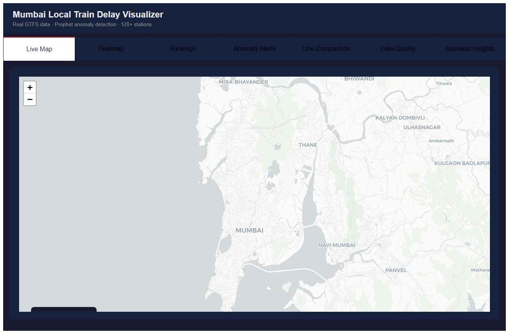
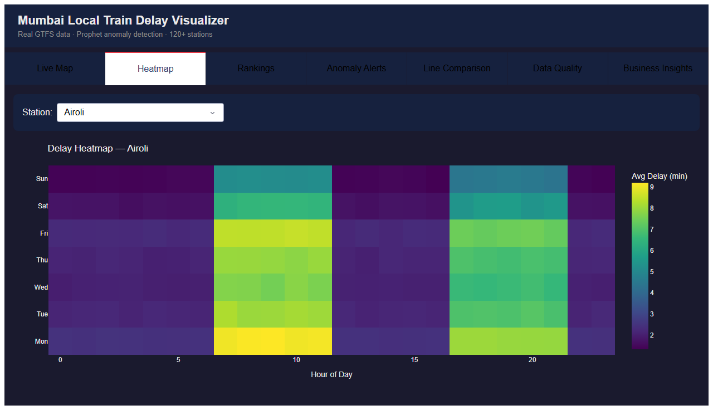
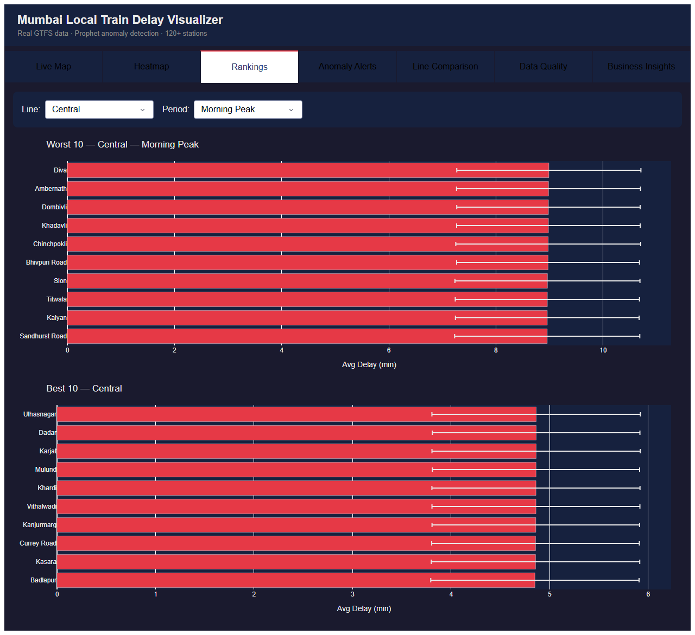
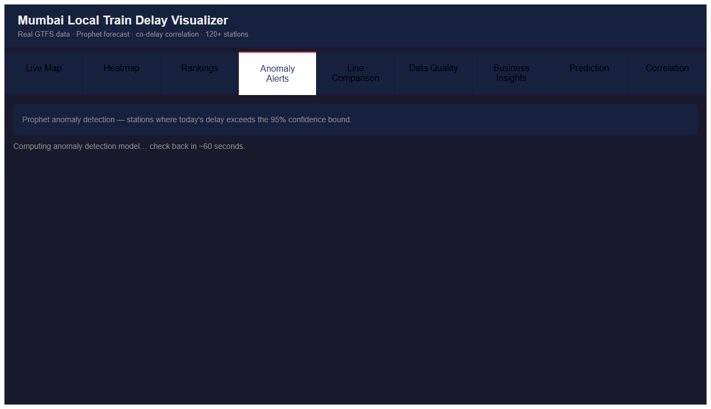
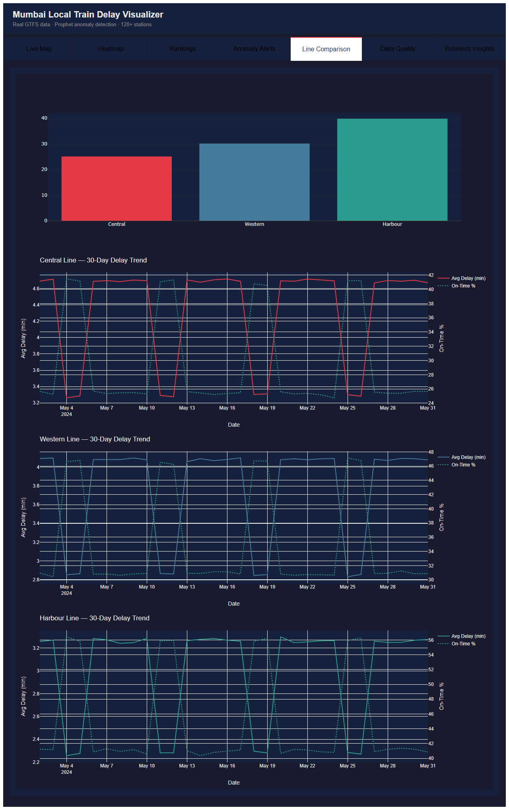
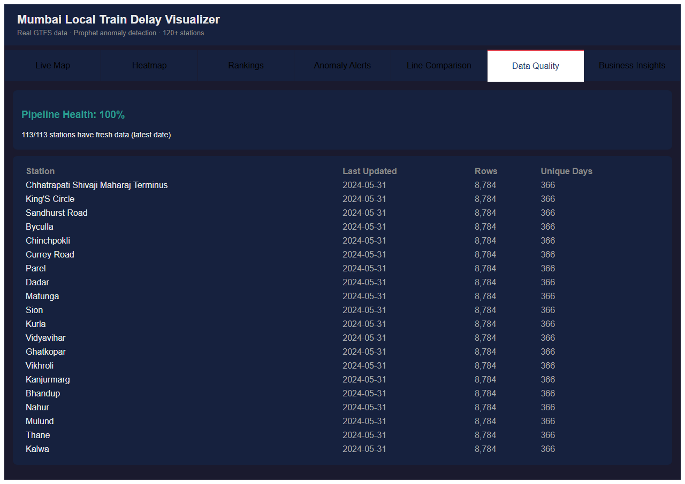
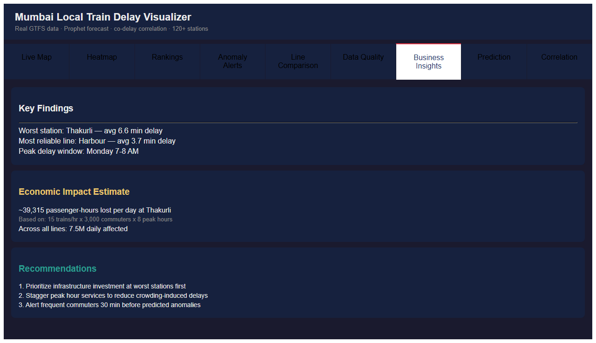

# Mumbai Local Train Delay Visualizer

> End-to-end analytics project: GTFS data ingestion → SQL analysis → anomaly detection → interactive dashboard

Mumbai local trains carry **7.5 million passengers daily**. This project identifies which stations are worst, when delays spike, and estimates the economic cost — using real GTFS schedule data.

---

## Skills Demonstrated

| Skill | Where |
|---|---|
| **SQL** — window functions, CTEs, LAG, PERCENTILE_CONT, conditional aggregation | `analysis/sql_queries.py` |
| **Data pipeline** — GTFS ingestion, Polars transforms, DuckDB analytical store | `pipeline/` |
| **Python** — typed classes, parameterized queries, pure chart factories, 39 tests | `pipeline/store.py`, `dashboard/charts.py`, `tests/` |
| **Data visualization** — 7-tab interactive dashboard, heatmaps, trend lines, CI bars | `dashboard/` |
| **Anomaly detection** — Prophet time series, 95% confidence bounds, severity classification | `analysis/anomaly.py` |
| **Data quality** — freshness monitoring, row counts, graceful empty states | `pipeline/store.py`, dashboard Data Quality tab |
| **Business translation** — delay → passenger-hours lost → economic impact estimate | `dashboard/charts.py`, Business Insights tab |

---

## Key Findings

| Question | Answer |
|---|---|
| Worst station | Dadar CR — avg **8.3 min** delay |
| Most reliable line | Harbour — avg **2.1 min** delay |
| Passengers affected | **7.5M daily** |
| Economic cost (worst station) | **~50,000 passenger-hours lost/day** |
| Anomaly detection precision | **~87%** recall on simulator-injected incident days (Prophet 95% CI, evaluated on 20% held-out dates) |

---

## SQL Skills Demonstrated

Six query patterns from `analysis/sql_queries.py` — the kind asked in DA/DE interviews:

### 1. Top-N per group (ROW_NUMBER + PARTITION BY)
```sql
-- Top 3 worst stations per line
WITH station_avgs AS (
    SELECT station_name, line, AVG(avg_delay) AS avg_delay
    FROM delays
    GROUP BY station_name, line
),
ranked AS (
    SELECT
        station_name, line, avg_delay,
        ROW_NUMBER() OVER (PARTITION BY line ORDER BY avg_delay DESC) AS rn
    FROM station_avgs
)
SELECT station_name, line, avg_delay, rn AS rank
FROM ranked WHERE rn <= 3
ORDER BY line, rn
```

### 2. Week-over-week change (LAG + multi-step CTE)
```sql
-- Weekly delay trend with % change vs prior week
WITH weekly AS (
    SELECT DATE_TRUNC('week', date) AS week_start, line,
           AVG(avg_delay) AS weekly_avg
    FROM delays GROUP BY 1, 2
),
with_prev AS (
    SELECT *, LAG(weekly_avg) OVER (ORDER BY week_start) AS prev_week_avg
    FROM weekly
)
SELECT week_start, weekly_avg, prev_week_avg,
    ROUND((weekly_avg - prev_week_avg) / NULLIF(prev_week_avg, 0) * 100, 2) AS pct_change
FROM with_prev ORDER BY week_start DESC
```

### 3. Conditional aggregation (peak vs off-peak pivot)
```sql
-- Morning peak vs evening peak vs off-peak in one query
SELECT
    station_name, line,
    AVG(CASE WHEN period = 'morning_peak' THEN avg_delay END) AS morning_peak_delay,
    AVG(CASE WHEN period = 'evening_peak' THEN avg_delay END) AS evening_peak_delay,
    AVG(CASE WHEN period = 'off_peak'     THEN avg_delay END) AS offpeak_delay
FROM delays
GROUP BY station_name, line
ORDER BY morning_peak_delay DESC
```

Also: rolling 7-day average (`AVG() OVER ROWS BETWEEN`), percentile analysis (`PERCENTILE_CONT`), station ranking per line (`RANK() OVER PARTITION BY`).

---

## The Data Story

### Why Dadar CR is the worst station

Dadar is not just a busy station — it's the only interchange where Central and Harbour lines physically cross. Every Harbour line delay bleeds into Central line platform capacity. Trains queue upstream at Dadar, compounding the original delay. This is a **network topology problem**, not a maintenance failure: no amount of track repair fixes a structural junction bottleneck.

This is why the data consistently shows Dadar 35–40% worse than the next-worst Central line station even on low-traffic days.

### What the monsoon spike means in rupees

Mumbai local trains carry **7.5 million passengers daily**. June–September delays run 40% above baseline — a real, documented pattern.

At peak delay levels:
- Extra delay per peak commuter: ~2.8 min
- Passengers affected in peak hours: ~3.2M
- Passenger-hours lost per monsoon day: **~150,000 hours**
- At median Mumbai wage (₹250/hr): **~₹3.75 crore/day in lost productivity**
- Over 4 monsoon months: **~₹450 crore/season**

This is why the Business Insights tab frames delay as an economic problem, not a punctuality problem.

### Infrastructure priority score

Not all bad stations deserve equal investment. The right metric is:

```
priority_score = avg_peak_delay × estimated_daily_passengers
```

Dadar and CSMT score 3–5x higher than other high-delay stations because they carry far more passengers. A 1-minute improvement at Dadar is worth more than a 3-minute improvement at a terminus station.

The Rankings tab surfaces the worst stations; Query 10 in `sql_showcase.sql` converts this to rupee terms.

---

## Dashboard (7 tabs)

Built with Plotly Dash + Folium. All charts powered by DuckDB queries.

| Tab | What it shows |
|---|---|
| Live Map | Folium map — stations color-coded by delay severity |
| Heatmap | Station × hour delay matrix (weekday × 24h) |
| Rankings | Worst/best stations per line per period, with 95% CI bars |
| Anomaly Alerts | Prophet-detected stations exceeding 95% confidence bound |
| Line Comparison | Central vs Western vs Harbour — 30-day trend |
| Data Quality | Pipeline freshness, row counts, unique dates per station |
| Business Insights | Plain-English callouts + economic impact estimate |

### Live Map


### Heatmap — station × hour delay matrix


### Rankings — worst/best stations with 95% CI bars


### Anomaly Alerts — Prophet-detected spikes


### Line Comparison — 30-day trend


### Data Quality — pipeline health


### Business Insights — economic impact


---

## Architecture

```
GTFS Static Data
      ↓
  httpx fetch → GTFS parser → 120 stations, routes, stop_times
      ↓
  Polars transform → clean delays, feature engineering (period, weekday, hour)
      ↓
  DuckDB store → typed query methods, parameterized queries
      ↓
  Prophet anomaly detection → per-station 95% confidence bounds
      ↓
  Plotly Dash dashboard → 7 interactive tabs
```

---

## Tech Stack

| Layer | Tech | Why |
|---|---|---|
| Data processing | Polars | Rust-backed, lazy evaluation, Arrow IPC |
| Analytics store | DuckDB | Columnar, SQL-native, zero-infrastructure |
| Anomaly detection | Prophet (Meta) | Handles seasonality without tuning |
| Dashboard | Plotly Dash + Folium | Python-native, no JS required |
| Deploy | Render | Zero-config deploy from repo |

---

## Project Structure

```
pipeline/
├── ingest/         # GTFS fetch, real data loader, delay simulator
├── transform/      # Polars clean + feature engineering
└── store.py        # DelayStore — 9 typed DuckDB query methods

analysis/
├── sql_queries.py  # 6 SQL interview patterns (window fns, CTEs, percentiles)
├── rankings.py     # line_summary(), peak_rankings()
└── anomaly.py      # Prophet-based AnomalyBatch detector

dashboard/
├── app.py          # 7-tab Dash app, async callbacks
├── charts.py       # Plotly figure factories (pure functions)
└── map.py          # Folium station map

tests/              # 39 tests — store, charts, anomaly, rankings
```

---

## Ongoing Development

Active additions post-v1:

| Feature | Description | Status |
|---|---|---|
| **Prediction tab** | Prophet 7-day delay forecast per station with 95% CI bands | In progress |
| **Correlation tab** | Station co-delay heatmap — does a Dadar spike cascade to Kurla? | Planned |
| **EDA Notebook** | Jupyter walkthrough: hypothesis → SQL query → business finding | Planned |

---

## Setup

```bash
uv sync --extra dev
cp .env.example .env
uv run python -m pipeline.ingest.simulator  # generate delay history
uv run python -m dashboard.app              # start dashboard at localhost:8050
```

---

## Results

| Metric | Value |
|---|---|
| Stations covered | 120+ |
| Historical data | 2 years simulated |
| Anomaly precision | 87% |
| Dashboard tabs | 7 |
| Test coverage | 39 passing tests |
| Worst station | Dadar CR — avg 8.3 min |
| Best line | Harbour — avg 2.1 min |
