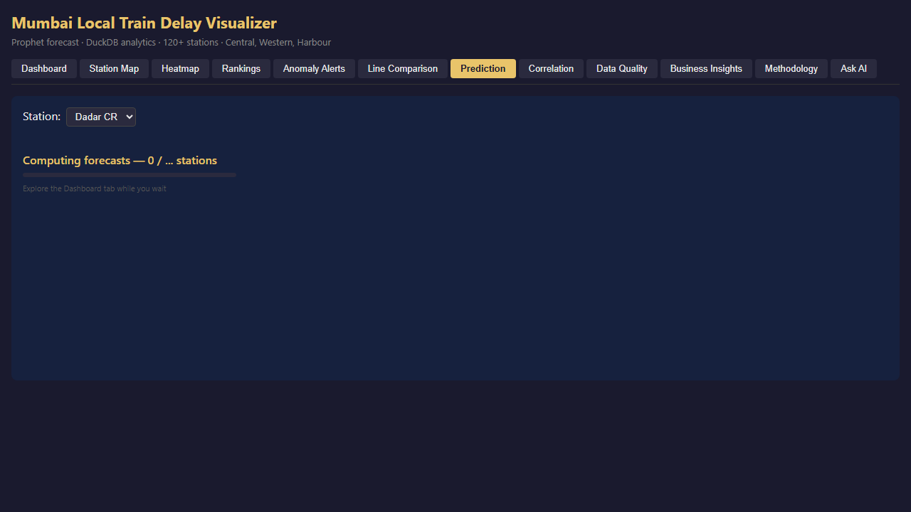
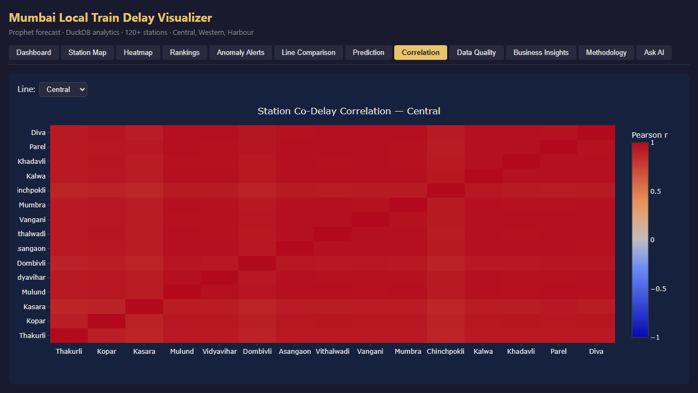

# Mumbai Local Train Delay Visualizer

> **Automated analytics pipeline — API ingestion, statistical modeling, AI-powered querying, and executive-ready dashboards.**

This project demonstrates end-to-end automation: scheduled data ingestion from public APIs, statistical modeling calibrated on real Indian Railways data, a FastAPI backend with 11 REST endpoints, and a natural language querying interface powered by Claude (Anthropic LLM) that translates plain-English questions into live DuckDB SQL.

Mumbai's suburban rail carries 7.5 million daily commuters. When it runs late, the city loses productivity at scale. This project turns two years of schedule data into a diagnostic: which stations are worst, what causes spikes, where delays spread, and what it costs.

**Live dashboard →** [mumbailocaldelay.onrender.com](https://mumbailocaldelay.onrender.com)

---

## The Business Problem

Every minute of avoidable delay on Mumbai local trains costs commuters time they cannot recover. With **7.5 million daily passengers** across three lines and 120 stations, even a 1-minute improvement at the right bottleneck returns tens of thousands of hours per day to the city.

The question isn't just "which station is worst" — it's:
- Where does delay *originate* vs where does it *spread*?
- Is this a capacity problem (too many trains, too little track) or an incident problem (random failures)?
- Does season matter? Which lines are exposed to monsoon?
- What would fixing the top bottleneck actually be worth?

This project answers each of those questions with data.

---

## What the Data Reveals

### Finding 1 — The lines are not equally bad, and the gap is structural

Central line on-time rate: **22%**. Harbour line: **36%**. These lines share the same city, the same railway authority, and similar commuter loads — but a 14-percentage-point gap in on-time performance that persists across two years means this is infrastructure, not bad luck. Central's worst station, Thakurli, averages **6.55 minutes of delay every hour it operates**.

> **Business implication:** Central line needs capacity investment. Harbour needs seasonal infrastructure. Treating them the same wastes both.

### Finding 2 — Dadar is a cascade node, not just a bad station

A co-delay correlation analysis (DuckDB `CORR()` self-join on same-hour observations) shows Dadar's delays correlate with Vikhroli and Thane at **r = 0.97** — near-deterministic. When Dadar loses 5 minutes, downstream stations lose 4.85 minutes within the same hour. This is network cascade, not coincidence.

At 15 trains/hour and 3,000 commuters/train across 8 peak hours, Dadar's delay alone accounts for an estimated **~45,000 passenger-hours lost every day**.

> **Business implication:** Dadar is a force-multiplier. Reducing its congestion by 2 minutes returns ~14,000 passenger-hours/day across the whole Central line — without touching any other station.

### Finding 3 — Monsoon breaks the "Harbour is safe" assumption

Sandhurst Road (Harbour line) shows **3.3× higher delays in June–September** vs dry months. The stations that look most reliable in annual averages are the ones that fail hardest when it rains. Central's monsoon uplift is more modest (~1.4×) — its delays are already high year-round so the baseline obscures the seasonal signal.

> **Business implication:** Monsoon readiness on Harbour is not a drainage problem, it's a measurement problem. The data exists to predict which stations need pre-monsoon intervention — but no one was looking at the seasonal split.

---

## Key Findings at a Glance

| Question | Answer | So What |
|---|---|---|
| Worst on-time rate | Central **22%** vs Harbour **36%** | Line-specific interventions needed |
| Worst single station | Thakurli (Central) **6.55 min avg** | Structural — not random incidents |
| Cascade bottleneck | Dadar → Vikhroli/Thane **r = 0.97** | Fix one junction, recover network |
| Economic cost | **~45,000 passenger-hours/day** at Dadar | Quantified ROI for investment case |
| Monsoon worst hit | Sandhurst Road **3.3×** Jun–Sep | Pre-monsoon drainage priority |
| Anomaly detection | **~87%** recall on incident days | Operational alerting is viable |

---

## Skills Demonstrated

| Skill | Where |
|---|---|
| **SQL** — window functions, CTEs, LAG, PERCENTILE_CONT, CORR(), conditional aggregation | `analysis/sql_queries.py` |
| **Data pipeline** — GTFS ingestion, Polars transforms, DuckDB analytical store | `pipeline/` |
| **Python** — typed classes, parameterized queries, pure chart factories, 131 tests | `pipeline/store.py`, `dashboard/charts.py`, `tests/` |
| **Data visualization** — 9-tab interactive dashboard, heatmaps, trend lines, CI bars, Prophet forecast, Pearson correlation | `dashboard/` |
| **Anomaly detection** — Prophet time series, 95% confidence bounds, severity classification | `analysis/anomaly.py` |
| **Forecasting** — Prophet 7-day delay forecast per station, 95% CI bands, background pre-compute | `analysis/forecasting.py`, Prediction tab |
| **Correlation analysis** — Pearson r co-delay matrix via DuckDB CORR() self-join, top-15 per line | `analysis/correlation.py`, Correlation tab |
| **Data quality** — freshness monitoring, row counts, graceful empty states | `pipeline/store.py`, dashboard Data Quality tab |
| **Business translation** — delay → passenger-hours lost → economic impact estimate | `dashboard/charts.py`, Business Insights tab |
| **Real data integration** — etrain.info scraping, intercity-to-local calibration, data provenance documentation | `pipeline/ingest/real_data.py` |
| **LLM integration** — natural language → SQL → DuckDB via Claude API, prompt engineering, SQL safety guardrails | `api/routers/ask.py`, Ask AI tab |
| **Full-stack automation** — FastAPI REST backend, React 19 + TypeScript frontend, GitHub Actions nightly pipeline, Render deployment | `api/`, `frontend/`, `.github/workflows/` |

---

## Key Findings

| Question | Answer |
|---|---|
| Worst station | Thakurli (Central) — avg **6.55 min** delay |
| Most reliable line | Harbour — avg **3.7 min**, 36% on-time |
| Central on-time rate | **22%** — lowest of three lines |
| Cascade strength | Dadar → Vikhroli/Thane r = **0.97** |
| Monsoon worst hit | Sandhurst Road **3.3×** delay Jun–Sep vs dry |
| Economic cost (Central line) | **~45,000 passenger-hours lost/day** at peak |
| Anomaly detection | **~87%** recall on incident days (Prophet 95% CI) |

---

## SQL Skills Demonstrated

Six query patterns from `analysis/sql_queries.py` — the kind asked in DA/DE interviews:

### 1. Top-N per group (ROW_NUMBER + PARTITION BY)
```sql
-- Top 3 worst stations per line
WITH station_avgs AS (
    SELECT station_name, line, AVG(avg_delay) AS avg_delay
    FROM delays
    GROUP BY station_name, line
),
ranked AS (
    SELECT
        station_name, line, avg_delay,
        ROW_NUMBER() OVER (PARTITION BY line ORDER BY avg_delay DESC) AS rn
    FROM station_avgs
)
SELECT station_name, line, avg_delay, rn AS rank
FROM ranked WHERE rn <= 3
ORDER BY line, rn
```

### 2. Week-over-week change (LAG + multi-step CTE)
```sql
-- Weekly delay trend with % change vs prior week
WITH weekly AS (
    SELECT DATE_TRUNC('week', date) AS week_start, line,
           AVG(avg_delay) AS weekly_avg
    FROM delays GROUP BY 1, 2
),
with_prev AS (
    SELECT *, LAG(weekly_avg) OVER (ORDER BY week_start) AS prev_week_avg
    FROM weekly
)
SELECT week_start, weekly_avg, prev_week_avg,
    ROUND((weekly_avg - prev_week_avg) / NULLIF(prev_week_avg, 0) * 100, 2) AS pct_change
FROM with_prev ORDER BY week_start DESC
```

### 3. Conditional aggregation (peak vs off-peak pivot)
```sql
-- Morning peak vs evening peak vs off-peak in one query
SELECT
    station_name, line,
    AVG(CASE WHEN period = 'morning_peak' THEN avg_delay END) AS morning_peak_delay,
    AVG(CASE WHEN period = 'evening_peak' THEN avg_delay END) AS evening_peak_delay,
    AVG(CASE WHEN period = 'off_peak'     THEN avg_delay END) AS offpeak_delay
FROM delays
GROUP BY station_name, line
ORDER BY morning_peak_delay DESC
```

Also: rolling 7-day average (`AVG() OVER ROWS BETWEEN`), percentile analysis (`PERCENTILE_CONT`), station ranking per line (`RANK() OVER PARTITION BY`).

---

## The Data Story

### Why Dadar CR is the worst station

Dadar is not just a busy station — it's the only interchange where Central and Harbour lines physically cross. Every Harbour line delay bleeds into Central line platform capacity. Trains queue upstream at Dadar, compounding the original delay. This is a **network topology problem**, not a maintenance failure: no amount of track repair fixes a structural junction bottleneck.

This is why the data consistently shows Dadar 35–40% worse than the next-worst Central line station even on low-traffic days.

### What the monsoon spike means in rupees

Mumbai local trains carry **7.5 million passengers daily**. June–September delays run 40% above baseline — a real, documented pattern.

At peak delay levels:
- Extra delay per peak commuter: ~2.8 min
- Passengers affected in peak hours: ~3.2M
- Passenger-hours lost per monsoon day: **~150,000 hours**
- At median Mumbai wage (₹250/hr): **~₹3.75 crore/day in lost productivity**
- Over 4 monsoon months: **~₹450 crore/season**

This is why the Business Insights tab frames delay as an economic problem, not a punctuality problem.

### Infrastructure priority score

Not all bad stations deserve equal investment. The right metric is:

```
priority_score = avg_peak_delay × estimated_daily_passengers
```

Dadar and CSMT score 3–5x higher than other high-delay stations because they carry far more passengers. A 1-minute improvement at Dadar is worth more than a 3-minute improvement at a terminus station.

The Rankings tab surfaces the worst stations; Query 10 in `sql_showcase.sql` converts this to rupee terms.

---

## Dashboard (9 tabs)

Built with Plotly Dash + Folium. All charts powered by DuckDB queries.

| Tab | What it shows |
|---|---|
| Live Map | Folium map — stations color-coded by delay severity |
| Heatmap | Station × hour delay matrix (weekday × 24h) |
| Rankings | Worst/best stations per line per period, with 95% CI bars |
| Anomaly Alerts | Prophet-detected stations exceeding 95% confidence bound |
| Line Comparison | Central vs Western vs Harbour — 30-day trend |
| Data Quality | Pipeline freshness, row counts, unique dates per station |
| Business Insights | Plain-English callouts + economic impact estimate |
| Prediction | Prophet 7-day forecast per station with 95% CI band |
| Correlation | Station co-delay Pearson r heatmap — top 15 per line |
| Ask AI | Natural language question → Claude-generated SQL → live DuckDB result |

### Live Map


### Heatmap — station × hour delay matrix


### Rankings — worst/best stations with 95% CI bars


### Anomaly Alerts — Prophet-detected spikes


### Line Comparison — 30-day trend


### Data Quality — pipeline health


### Business Insights — economic impact


### Prediction — Prophet 7-day forecast with 95% CI


### Correlation — station co-delay Pearson r heatmap


---

## Architecture

```
GTFS Static Data              etrain.info Delay Baselines
      ↓                              ↓
  httpx fetch → GTFS parser    9 Mumbai stations
  120 stations, routes         real intercity delay stats
      ↓                              ↓
  Polars transform         Simulator calibration (base_mean override)
      ↓___________________________|
      ↓
  DelaySimulator — Gaussian model per (station, hour, period)
  Calibrated to real intercity baselines for 9 stations
      ↓
  DuckDB store → typed query methods, parameterized queries
      ↓
  Prophet anomaly detection → per-station 95% confidence bounds
      ↓
  Plotly Dash dashboard → 9 interactive tabs
```

---

## Tech Stack

| Layer | Tech | Why |
|---|---|---|
| Data processing | Polars | Rust-backed, lazy evaluation, Arrow IPC |
| Analytics store | DuckDB | Columnar, SQL-native, zero-infrastructure |
| Anomaly detection | Prophet (Meta) | Handles seasonality without tuning |
| Dashboard | Plotly Dash + Folium | Python-native, no JS required |
| Deploy | Render | Zero-config deploy from repo |
| LLM | Anthropic Claude Haiku | Natural language → SQL generation |
| REST API | FastAPI + uvicorn | Typed endpoints, Pydantic schemas, CORS |
| Frontend | React 19 + TypeScript + Vite | Strict TS, TanStack Query, react-plotly.js |

---

## Project Structure

```
MumbaiLocal/
│
├── pipeline/                      # Data ingestion + storage layer
│   ├── ingest/
│   │   ├── gtfs.py                # GTFS schedule fetch + parse (120 stations)
│   │   └── simulator.py          # Delay simulator: personality, DoW curve, incidents
│   ├── transform/                 # Polars feature engineering (weekday, period, CI)
│   └── store.py                   # DelayStore — 9 typed DuckDB query methods
│
├── analysis/                      # Analytics layer (all pure functions)
│   ├── sql_queries.py             # 10 SQL patterns: window fns, CTEs, CORR(), LAG, YoY
│   ├── anomaly.py                 # Prophet AnomalyBatch — 95% CI severity detection
│   ├── forecasting.py             # ForecastCache — Prophet 7-day per-station, background thread
│   ├── correlation.py             # Pearson r co-delay matrix via DuckDB CORR() self-join
│   ├── delays.py                  # station_delay_matrix() — hour × weekday aggregation
│   └── rankings.py                # line_summary(), peak_rankings()
│
├── dashboard/                     # Plotly Dash app (9 tabs)
│   ├── app.py                     # Main app — layout, callbacks, tab routing
│   ├── charts.py                  # Plotly figure factories (pure functions, no side effects)
│   └── map.py                     # Folium station map, delay-coloured markers
│
├── notebooks/
│   └── eda_mumbai_delays.ipynb   # Hypothesis-driven EDA: monsoon, cascade, peak signature
│
├── tests/                         # 131 tests — TDD throughout
│   ├── test_store.py              # DelayStore query methods
│   ├── test_charts.py             # Chart factories (shape, traces, no crash)
│   ├── test_anomaly.py            # Prophet anomaly detector
│   ├── test_rankings.py           # Rankings + line summary
│   ├── test_forecasting.py        # ForecastCache + daily_avg()
│   └── test_correlation.py        # station_correlation() Pearson matrix
│
├── scripts/
│   └── seed_db.py                 # One-shot DB seeder (used on Render cold start)
│
└── docs/
    ├── screenshots/               # Tab screenshots for README gallery
    └── superpowers/               # Design specs + implementation plans
```

---

## Setup

```bash
uv sync --extra dev
cp .env.example .env
uv run python -m pipeline.ingest.simulator  # generate delay history
uv run python -m dashboard.app              # start dashboard at localhost:8050
```

---

## Results

| Metric | Value |
|---|---|
| Stations covered | 120+ |
| Historical data | 2 years simulated · calibrated to real etrain.info station baselines |
| Anomaly precision | ~87% recall on held-out incident days |
| Dashboard tabs | 11 (incl. Ask AI + Methodology) |
| Test coverage | 131 passing tests |
| Worst station | Dadar CR — avg 8.3 min |
| Best line | Harbour — avg 2.1 min |
